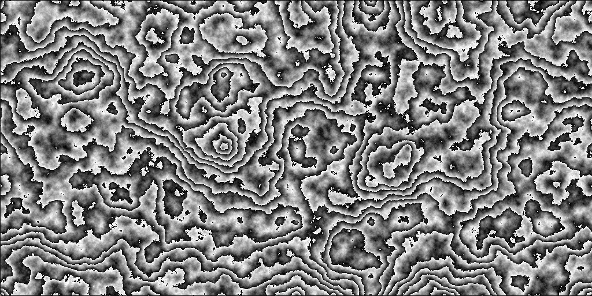

# Plasma Demo

Based on the [diamond-square algorithm](https://en.wikipedia.org/wiki/Diamond-square_algorithm). I followed and tweaked the technique of [Charles Randall](https://www.bluh.org/code-the-diamond-square-algorithm/), who in turn followed and tweaked the algorithm from [Notch](http://ludumdare.com/compo/ludum-dare-22/?action=preview&uid=398). I used some hacky ass color cycling / pallette shifting for the animation.  

The windowing and opengl is handled by a small single-header-file graphics engine by [OneLoneCoder](http://onelonecoder.com/) called [olcPixelEngine](https://github.com/OneLoneCoder/olcPixelGameEngine). The macport was done by [MumflrFumperdink](https://github.com/MumflrFumperdink/olcPGEMac).
